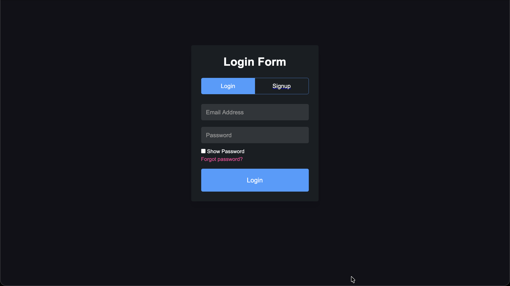
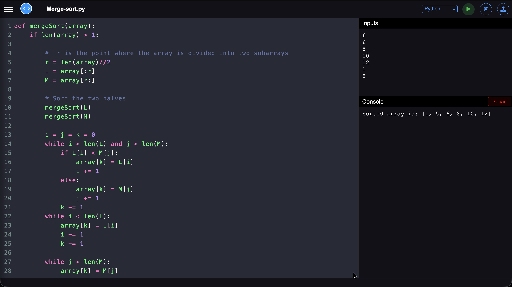
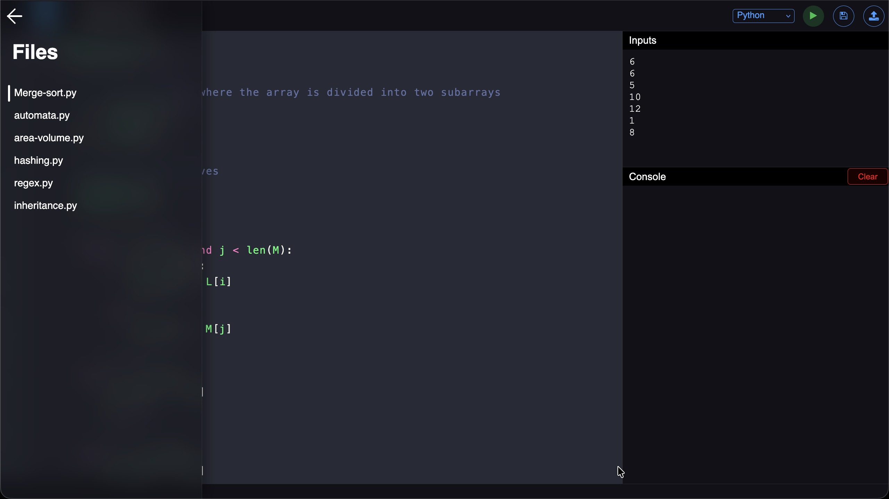

<div align="center" id="top"> 
  

  &#xa0;

  <!-- <a href="https://facesearch.netlify.app">Demo</a> -->
</div>

<h1 align="center">CodeWare</h1>

<p align="center">
  

  

  

  

  

  

  
</p>

<p align="center">
  <a href="#dart-about">About</a> &#xa0; | &#xa0; 
  <a href="#sparkles-features">Features</a> &#xa0; | &#xa0;
  <a href="#rocket-technologies">Technologies</a> &#xa0; | &#xa0;
  <a href="#white_check_mark-requirements">Requirements</a> &#xa0; | &#xa0;
  <a href="#checkered_flag-starting">Starting</a> &#xa0; | &#xa0;
  <a href="#fireworks-screenshots">Screenshots</a> &#xa0; | &#xa0;
  <a href="#memo-license">License</a> &#xa0; | &#xa0;
  <a href="https://github.com/KhushalJangid" target="_blank">Author</a>
</p>

<br>

## :dart: About ##

This is an online code editor that works on Django(Python) in backend, Made for Tech-a-Thon 2022 at JECRC University. Supports C, C++, Python, JS, Dart programming languages

## :sparkles: Features ##

:heavy_check_mark: Write & Edit code online\
:heavy_check_mark: Compile code on the go\
:heavy_check_mark: Open & Edit local code files\
:heavy_check_mark: Download code files to your local machine\
:heavy_check_mark: Cloud Save for files on the server

## :rocket: Technologies ##

The following tools were used in this project:

- [Django](https://djangoproject.com/)
- [Python](https://python.org)
- [HTML](https://developer.mozilla.org/en-US/docs/Web/HTML)


## :white_check_mark: Requirements ##

Before starting :checkered_flag:, you need to have [Git](https://git-scm.com) and [Python](https://python.org/) installed.
It also requires compilers for supported languages [C/C++, JavaScript, Java, Python, Dart] on the local machine to compile the code (if docker is not used).

## :checkered_flag: Starting ##

```bash
# Clone this project
$ git clone https://github.com/KhushalJangid/codeware

# Access
$ cd codeware

# Install dependencies
$ python3 -m venv venv

# Install dependencies
$ source venv/bin/activate

# Install dependencies
$ pip install poetry

# Install dependencies
$ poetry install

# Run the project
$ python manage.py migrate

# Run the project
$ python manage.py runserver

# The server will initialize in the <http://localhost:8000>
```

Alternatively, Run using docker (No need to have compilers on local machine):

```bash
# Clone this project
$ git clone https://github.com/KhushalJangid/codeware

# Access
$ cd codeware

# Build Docker image
$ docker image build -t codeware .

# Run Docker container
$ docker run -p 8000:8000 codeware

# The server will initialize in the <http://localhost:8000>
```

## :fireworks: Screenshots ##





## :memo: License ##

This project is under license from MIT. For more details, see the [LICENSE](LICENSE) file.


Made with :heart: by <a href="https://github.com/KhushalJangid" target="_blank">Khushal Jangid</a> & <a href="https://github.com/satyam-mishra-pce" target="_blank">Satyam Mishra</a> 

&#xa0;

<a href="#top">Back to top</a>
